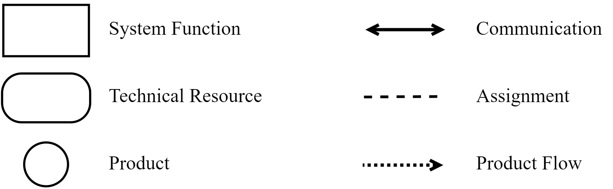
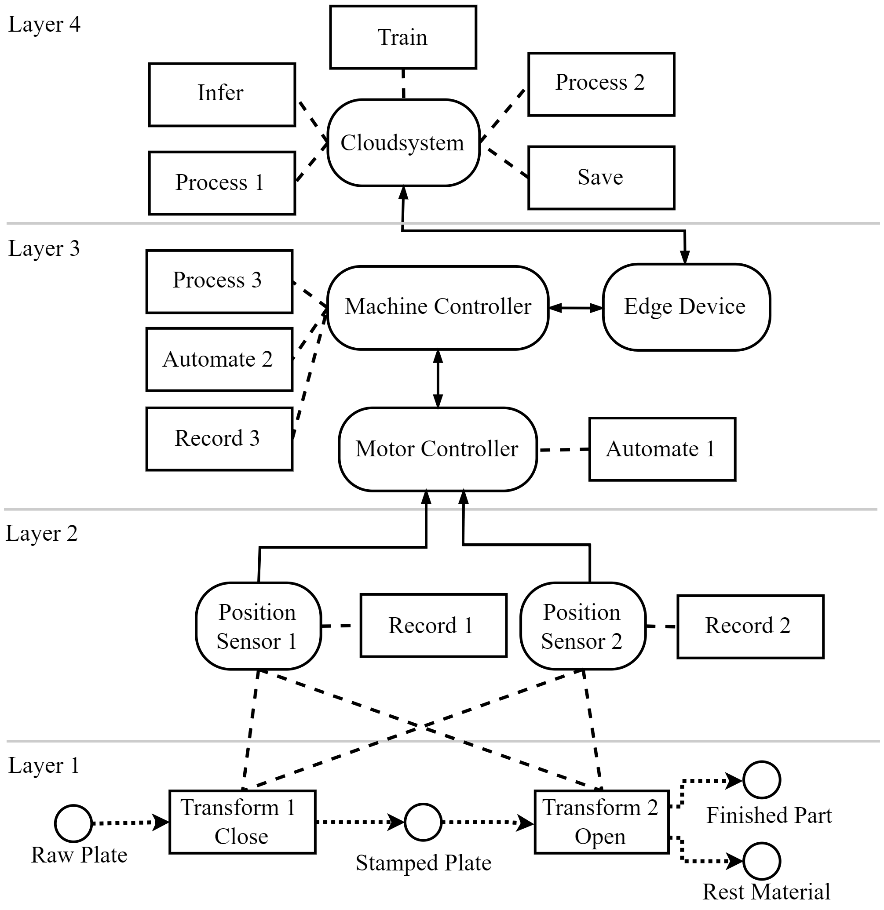
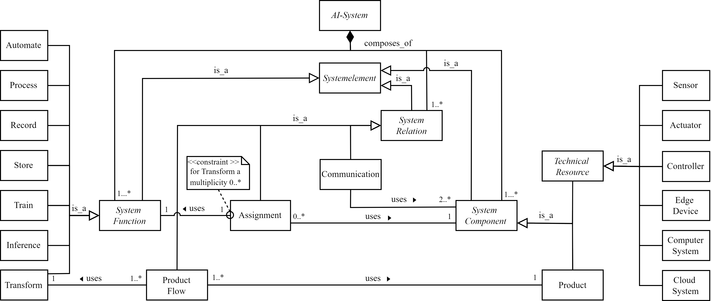

# Graphical Modeling Language for Artificial Intelligence Applications in Automation Systems

## Introduction
Despite these promising use cases, AI is still rarely used in industry overall. AI applications are often developed within research projects and to date, they can only be economically integrated to a limited extent in practice. This is partly due to the fact that the software development of AI systems faces additional challenges compared to conventional software development, which hinder the economical further development and integration of experimental AI solutions.

Accordingly, there is a lack of interdisciplinary and easily understandable models for the development of AI applications. These models need to simultaneously capture the relationships between individual system components, software components, and system processes while supporting collaboration between different experts. One way to address this gap is to provide a graphical representation of the system. Such a representation allows modeling the core of a problem in a formal and understandable way for different stakeholders.

A suitable Graphical Modeling Language for the interdisciplinary modeling of AI applications in automation systems using domain-specific concepts does not yet exist. To close this gap, a *Graphical Modeling Language for Artificial Intelligence Applications in Automation Systems* (GML-AIAAS) is presented.

## Modeling Elements
Systems can be described generally using the following four element classes *System Components*, *System Functions*, *System Relations* and *System Structure*. These Classes and their interdependencies are described in the following.

### System Components
System components define the building blocks that the system comprises. According to automation system, two types of system components are defined: Products and Technical Resources. Products are the things of the real world that are transformed during a technical process. Technical resources are the system components that build up the actual system and perform the system functions. For the GML-AIAAS, six possible categories of technical resources are defined:
- **Automate**: Read and process (sensor) values, and then control actuators to operate a technical process. This function describes that a technical process is automated by executing a program in the plant.
- **Transform**: Transforms real-world input products into output products in a technical process, for example a semifinished product into a workpiece through a machining process.
- **Record**: Captures and digitizes physical properties (pressure, temperature). The record function also includes the recording of non-physical properties, such as time information or economic information (prices, stocks).
- **Store**: Stores data according to a certain system, for a certain time at a certain place.
- **Process**: Processes and transforms input data or measured values into output data by a defined algorithm. An example is data pre-processing or post-processing. No data-driven algorithm may be used.
- **Train**: Adjusts the parameters of a data-driven algorithm based on historical data.
- **Inference**: Converts input data into output data using a data-driven algorithm. A training must have already adjusted the data-driven algorithm.

### System Functions
System functions convert a given input into an output, thereby enabling the system to achieve its goals. These functions can be performed by technical resources. Seven categories of system functions are defined:
- **Automate**: Read and process (sensor) values, and then control actuators to operate a technical process. This function describes that a technical process is automated by executing a program in the plant.
- **Transform**: Transforms real-world input products into output products in a technical process, for example a semifinished product into a workpiece through a machining process.
- **Record**: Captures and digitizes physical properties (pressure, temperature). The record function also includes the recording of non-physical properties, such as time information or economic information (prices, stocks).
- **Store**: Stores data according to a certain system, for a certain time at a certain place.
- **Process**: Processes and transforms input data or measured values into output data by a defined algorithm. An example is data pre-processing or post-processing. No data-driven algorithm may be used.
- **Train**: Adjusts the parameters of a data-driven algorithm based on historical data.
- **Inference**: Converts input data into output data using a data-driven algorithm. A training must have already adjusted the data-driven algorithm.

### System Relations
System relations describe the connections and relationships between system elements. Three categories of system relations are defined:
- **Communication**: A connection between at least two system components that describes the directed exchange of information between these. An example of this is the communication between a controller and a sensor via TCP/IP.
- **Assignment**: A structural connection between system functions and system components. It assigns one system function to one system component, for example a system function record could be assigned to a system component sensor. An exception is the transform function, which can be assigned to multiple system components
- **Product Flow**: A connection that describes the directed flow of a product between transformation functions.

### System Structure
The system structure defines an ordering principle according to how the individual components of the system are ordered and hierarchized. In automation engineering, the automation pyramid is an accepted, widely used and easily understandable way to order and hierarchize an automation system. Following this, a four-level system structure is defined:
- **Level 1:Technical Process Level**: Here, the transformation processes of the products are described.
- **Level 2: Field Device Level**: Here, the sensors and actuators are described.  
- **Level 3: Control and Monitoring Level**: Here, the control systems and edge devices are described.
- **Level 4: Computer and Cloud Level**: Here, the local and external computer and cloud systems are described.

## Defined Symbols
Standardized symbolism of the defined system elements allows simplifying the development process of an AI application. In addition, the results of the development can be communicated and documented more precisely. Therefore, a standardized symbolism is defined as following:

| |
|:--:|
| Standardized Symbols of GML-AIAAS |

## Example with Use-Case
The business goal of the presented use case is to reduce the maintenance costs of a stamping machine. The machine consists of a support frame, a fixed lower die and a movable upper die. The upper die is moved by an electric motor, which is mounted on the support frame. The driving force is transmitted via the drive belt and the position of the upper die is measured via two positional sensors. This machine performs a stamping process in which a metal plate is processed. The technical goal is to optimize its maintenance strategy by predicting the wear condition of the drive belt. Currently, the drive belt is maintained in fixed intervals.
Some interviews with process operators revealed that a worn-out drive belt causes an oscillation of the upper stamp die when it gets positioned. Based on that assumption, the measured positioning values recorded during the stamping process can be used to infer the belt wear condition. For the automated analysis of this position data, an AI application should be developed. In the following figure a possible modeling is presented.

| |
|:--:|
| Standardized Symbols of GML-AIAAS |

## UML-Meta-Model
For further formalization a UML-Meta-Model is presented. This model captures all dependencies between the different modeling elements.

| |
|:--:|
| Formalization with UML of GML-AIAAS |

## How to cite

This modeling Language has been published in a conference paper. You can find this paper on [ResearchGate](https://www.researchgate.net/publication/373327442_A_Graphical_Modeling_Language_for_Artificial_Intelligence_Applications_in_Automation_Systems). You can also find a PrePrint on [arXiv](https://arxiv.org/abs/2306.11767). Feel free to contact us via ResearchGate in case you have questions about the paper.
In case you want to use this modeling language in your own research, please cite as:
```
M. Schieseck, P. Topalis, A. Fay: A Graphical Modeling Language
for Artificial Intelligence Applications in Automation Systems. In:
2023 IEEE 21st International Conference on Industrial Informatics
(INDIN). Lemgo, DE, 2023.
```
If you are using a BiBTex-file, you can copy the following:
```
@inProceedings{schieseck2023GML-AIAAS,
  author={Schieseck, Marvin and Topalis, Philip and Fay, Alexander},
  booktitle={2023 IEEE 21st International Conference on Industrial Informatics (INDIN)},
  title={A Graphical Modeling Language for Artificial Intelligence Applications in Automation Systems},
  address = {Lemgo, DE},
  year={2023}
}
```
